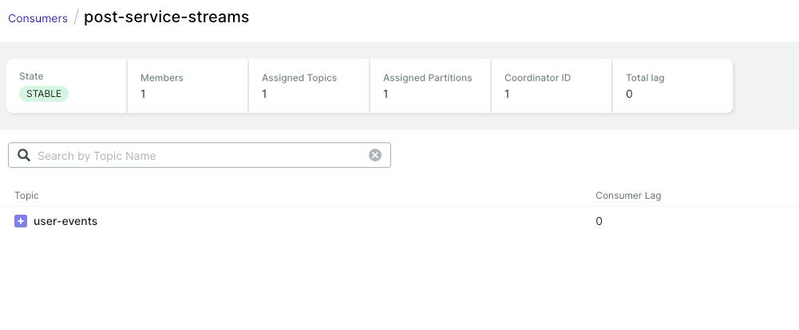
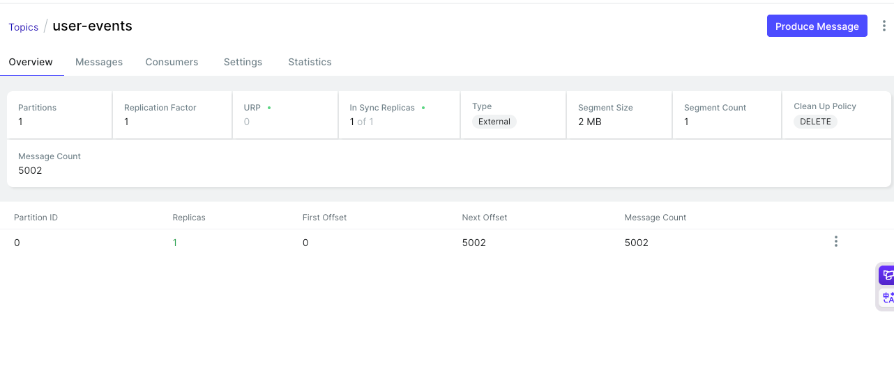

# Kafka Streams PostgreSQL Materialized View Example

이 프로젝트는 Kafka Streams를 사용하여 PostgreSQL 기반의 고급 Materialized View를 구현하는 예제입니다.

## 아키텍처

```
┌─────────────┐    ┌─────────────┐    ┌─────────────┐
│             │    │             │    │             │
│ User Service├────► Kafka Topic ├────► Post Service│
│             │    │             │    │             │
└─────────────┘    └─────────────┘    └─────┬───────┘
                                              │
                                              ▼
                                   ┌─────────────────┐
                                   │   PostgreSQL    │
                                   │ Materialized    │
                                   │     View        │
                                   └─────────────────┘
```

## 주요 기능

### 1. Kafka Streams 기반 실시간 처리
- User 이벤트 스트림 처리
- 실시간 Materialized View 업데이트
- Exactly-once 처리 보장

### 2. PostgreSQL Materialized View
- 사용자 정보 실시간 동기화
- 부서별 통계 자동 업데이트
- 인덱스 최적화

### 3. 고급 기능
- 이벤트 소싱 패턴
- CQRS 구현
- 장애 복구 및 재처리

## 시작하기

### 1. 환경 실행 멀티스테이지 빌드 캐시 무시하고 재빌드
```bash
# 모든 서비스 시작
docker-compose up -d
# 안되면 Docker 빌드 캐시 무시하고 재빌드
docker-compose build --no-cache

# 로그 확인
docker-compose logs -f post-service-kafka
```

### 2. 사용자 생성
```bash
# 사용자 생성
curl -X POST http://localhost:8081/api/users \
  -H "Content-Type: application/json" \
  -d '{
    "name": "홍길동",
    "email": "hong@example.com",
    "department": "개발팀",
    "status": "ACTIVE"
  }'

  curl -X POST http://localhost:8081/api/users \
  -H "Content-Type: application/json" \
  -d '{
    "name": "장웅",
    "email": "changwng@example.com",
    "department": "개발팀",
    "status": "ACTIVE"
  }'


  curl -X POST http://localhost:8081/api/users \
  -H "Content-Type: application/json" \
  -d '{
    "name": "new_장웅",
    "email": "new_changwng@example.com",
    "department": "개발팀",
    "status": "ACTIVE"
  }'

    curl -X POST http://localhost:8081/api/users \
  -H "Content-Type: application/json" \
  -d '{
    "name": "last_장웅",
    "email": "last_changwng@example.com",
    "department": "개발팀",
    "status": "ACTIVE"
  }'
  
   curl -X GET http://localhost:8081/api/users/7 \
  -H "Content-Type: application/json" 
   
  curl -X PUT http://localhost:8081/api/users/7 \
  -H "Content-Type: application/json" \
  -d  '{"id":7,"name":"modi_장웅","email":"last_changwng@example.com","department":"개발팀","status":"ACTIVE","createdAt":"2025-07-17T06:03:43.792924968","updatedAt":"2025-07-17T06:03:43.793003009"}'

curl -X DELETE http://localhost:8081/api/users/7 \
  -H "Content-Type: application/json" 

```

### 3. 포스트 생성
```bash
# 포스트 생성 (사용자 정보 자동 enrichment)
curl -X POST http://localhost:8082/api/posts \
  -H "Content-Type: application/json" \
  -d '{
    "title": "안녕하세요",
    "content": "첫 번째 포스트입니다.",
    "authorId": 6
  }'
```

### 4. Materialized View 확인
```bash
# 모든 사용자 조회
curl http://localhost:8082/api/posts/users

# 부서별 포스트 조회
curl http://localhost:8082/api/posts/by-department/개발팀
```

## 모니터링

### Kafka UI
- URL: http://localhost:8080
- Topic: user-events 모니터링

### PostgreSQL 직접 접근
```bash
docker exec -it postgres psql -U postgres -d materialized_view_db

# 사용자 뷰 조회
SELECT * FROM user_view;

# 부서별 통계 조회
SELECT * FROM department_stats;
```

## 고급 사용법

### 1. 이벤트 재처리
```bash
# Kafka 이벤트 재처리
./scripts/kafka-replay.sh -t user-events -o earliest
# 해당 이벤트 소비 확인
docker-compose logs post-service-kafka | grep -i 'state transition'
```

참고: kafka-replay.sh 스크립트의 동작
•	-o earliest: consumer offset을 처음부터
•	기본 동작은 메시지를 “보기”만 함 (consume and print)
•	메시지를 재전송하려면 consumer group offset 리셋 + post-service 재시작 필요

docker exec -it kafka kafka-topics --help

### 2. 사용자 정보 업데이트
```bash
# 사용자 정보 업데이트 (자동으로 포스트에 반영)
curl -X PUT http://localhost:8081/api/users/1 \
  -H "Content-Type: application/json" \
  -d '{
    "name": "홍길동 수정",
    "email": "hong.updated@example.com",
    "department": "기획팀",
    "status": "ACTIVE"
  }'
```

### 3. 성능 최적화
- PostgreSQL 인덱스 최적화
- Kafka Streams 파티션 조정
- 배치 처리 설정

## 테스트

### 통합 테스트 실행
```bash
# post-service 테스트
cd post-service
./gradlew test

# user-service 테스트
cd user-service
./gradlew test
```

### 수동 테스트 시나리오
1. 사용자 생성 → Materialized View 확인
2. 포스트 생성 → 사용자 정보 자동 enrichment 확인
3. 사용자 수정 → 기존 포스트 정보 업데이트 확인
4. 사용자 삭제 → Materialized View 정리 확인

## 트러블슈팅

### 일반적인 문제
1. **Kafka 연결 오류**: docker-compose logs kafka
2. **PostgreSQL 연결 오류**: docker-compose logs postgres
3. **Streams 처리 지연**: Kafka UI에서 lag 확인

### post-service의 사용자 삭제후 kafka에서 다시 받는 방법 ( offset을 리셋으로 만들기)
러의 의미: current state is Stable 피해가기
1. post-service down
2. user-service down : 이유 post-service-streams 컨슈머 그룹을 inactive 상태로  user-events를 보내고 받는곳을 다 재외후에 offset을  
3. ./scripts/kafka-replay.sh -t user-events -r post-service-streams 실행하면 유저 재생성됨
4. post-service start
5. user-service start
### 데이터 일관성 문제
```bash

./scripts/kafka-replay.sh -t user-events -r post-service-streams  실행후 표시 방법
GROUP                          TOPIC                          PARTITION  NEW-OFFSET     
post-service-streams           user-events                    0          0              

Reset complete. Please RESTART the application for group 'post-service-streams' to start reprocessing.


# Kafka Consumer Group 리셋
kafka-consumer-groups --bootstrap-server localhost:9092 \
  --group post-service-streams --reset-offsets --to-earliest \
  --topic user-events --execute
```

## 확장 가능성

### 1. 추가 Materialized View
- 포스트 통계 뷰
- 사용자 활동 뷰
- 부서별 성과 뷰

### 2. CDC (Change Data Capture) 추가
```yaml
# Debezium Connector 추가
debezium:
  image: debezium/connect:latest
  depends_on:
    - kafka
    - postgres
```

### 3. KSQLDB 통합
```yaml
# KSQLDB 서버 추가
ksqldb-server:
  image: confluentinc/ksqldb-server:latest
  depends_on:
    - kafka
```

## 리소스

- [Kafka Streams 공식 문서](https://kafka.apache.org/documentation/streams/)
- [PostgreSQL Materialized View](https://www.postgresql.org/docs/current/rules-materializedviews.html)
- [Spring Kafka Streams](https://docs.spring.io/spring-kafka/docs/current/reference/html/#kafka-streams) 


consumer group 이름이 다르면:
각 서비스는 모든 메시지를 독립적으로 소비(처음부터 읽거나, 원하는 오프셋부터 읽기 가능)
consumer group 이름이 같으면:
여러 인스턴스가 하나의 그룹으로 묶여 파티션을 분할해서 읽음(로드밸런싱, 메시지 중복 소비 없음)

### 50만명 데이터 생성시간 측정

select count(*) from user_view;
184793 으로 디비 연계가 같이 안돌아감 ... 그래서 튜닝이 필요함

452000명 생성 완료 (경과 시간: 1446.47초, 마지막 응답: 200)


💡 대략적인 Kafka 메시지 초당 처리량 기준
경 수준
초당 메시지 수
설명
개발/테스트 환경
100 ~ 1,000 msg/sec
간단한 개발, 로깅 또는 기능 테스트 수준
소규모 서비스 운영 환경
1,000 ~ 10,000 msg/sec
소규모 서비스, 마이크로서비스 연동 수준
중규모 운영 환경
10,000 ~ 100,000 msg/sec
다수의 마이크로서비스와 실시간 로그/이벤트 수집
대규모 운영 환경
100,000 ~ 1,000,000 msg/sec
스트리밍 분석, IoT, 클릭스트림 분석 등
초대형 기업/전문 인프라
수백만 msg/sec
Netflix, LinkedIn 등 카프카 내부 구조 확장 활용

2025-07-17 08:42:16,294] ERROR Error while loading log dir /var/lib/kafka/data (kafka.server.LogDirFailureChannel)

java.io.IOException: No space left on device


docker exec -it kafka kafka-topics --bootstrap-server localhost:9092 --list

# 이 명령은 user-events 토픽의 모든 메시지를 처음부터 출력해줍니다.
# → 사용자가 생성되었을 때의 Kafka 이벤트가 표시됩니다.

docker exec -it kafka \
kafka-console-consumer --bootstrap-server localhost:9092 \
--topic user-events --from-beginning
```shell
post-service 상태 확인

user-events는 있는데 post-service가 이를 소비하지 않고 오류 상태라면, 다음 원인들을 확인해보세요:
	•	post-service의 Kafka Streams가 제대로 초기화되었는가?
	•	Kafka Streams의 application.id가 중복되거나 변경되었는가?
	•	docker-compose logs -f post-service-kafka 로그에서 Caused by 또는 Exception 확인
```
# 3. 🔁 post-service offset 리셋 (이벤트 재소비)
```shell
# Streams 애플리케이션 중단 후 실행
docker-compose stop post-service-kafka

# 오프셋 초기화
docker exec -it kafka \
  kafka-consumer-groups --bootstrap-server localhost:9092 \
  --group post-service-streams \
  --reset-offsets --to-earliest \
  --topic user-events --execute

-- offset 초기화 결과 표시 
GROUP                          TOPIC                          PARTITION  NEW-OFFSET     
post-service-streams           user-events                    0          0   

# post-service 재시작
docker-compose start post-service-kafka
```


⸻
4. 🧪 통합 흐름 테스트 (REST API → Kafka → Materialized View)
    1.	사용자 등록 (POST /api/users)
    2.	Post 등록 (POST /api/posts)
    3.	Materialized View 조회 (GET /api/posts/users)
   4. 
5. ✅ Kafka Streams 상태 추적
Kafka Streams 인스턴스 상태를 확인하려면 로그에서 다음 상태 변화를 찾으세요:
 State transition from CREATED → RUNNING
   State transition from PENDING_ERROR → ERROR

-- 확인 처리 view 방법
docker exec -it postgres_kafka psql -U postgres -d materialized_view_db
SELECT * FROM user_view;

### user API에서 사용자 생성시 kafka를 통해서 post-service로 사용자가 생성되는데 생성 지연시간이 존재하는데 설명해줘
전체 흐름 요약
1.	user-service에서 Kafka 토픽 user-events에 메시지를 produce.
2.	Kafka 브로커가 메시지를 디스크에 기록.
3.	post-service는 Kafka Streams를 통해 해당 토픽을 구독(consume)하고 처리.
4.	post-service가 메시지를 읽고, 처리(DB에 저장 등)까지 완료.
      지연이 발생하는 주요 원인

⏱️ 지연이 발생하는 주요 원인
1. Kafka 자체의 비동기 처리 구조
   •	프로듀서(user-service)는 메시지를 전송하고 바로 리턴되므로 처리 완료 여부를 기다리지 않음.
   •	acks=1 또는 acks=all 설정에 따라 브로커로부터의 확인만 받고 리턴.
   •	user-service에서는 메시지 보낸 시점에서 성공 처리하지만, 실제로 post-service까지 도달하고 처리되기까지는 시간이 소요됨.

2. Kafka Streams 내부 처리 지연

Kafka Streams (post-service)는 다음과 같은 이유로 지연될 수 있습니다:

a. poll 주기 / 처리 주기
•	Kafka Streams는 내부적으로 poll() → process() → commit() 루프를 반복합니다.
•	이 사이클은 기본적으로 수십~수백 ms 단위로 반복됩니다.
•	내부적으로 max.poll.interval.ms, commit.interval.ms 등의 설정값이 처리 주기를 결정합니다.

b. Record cache flush latency
•	Streams는 성능 최적화를 위해 state store 캐시를 사용합니다.
•	예: materialized view를 저장하는 state store에 대한 업데이트는 버퍼에 잠시 머물다 flush 타이밍에만 반영됩니다.
•	cache.max.bytes.buffering, commit.interval.ms 등이 flush 지연에 영향을 줍니다.

c. Rebalance 중 상태 이동
•	Kafka Streams는 topology 변경이나 컨슈머 group rebalance 중에는 일시적으로 REBALANCING → RUNNING 상태로 전이되며 처리 지연이 발생할 수 있습니다.
3. Consumer group 처리 병목
   •	Consumer가 여러 파티션을 하나의 스레드로 처리하고 있다면, 순차처리로 인해 처리량/속도에 제한이 생깁니다.
   •	post-service가 하나의 인스턴스로 동작 중이라면 이 병목이 클 수 있습니다.

⸻
4. Spring Kafka 또는 Kafka Streams 설정
   •	Spring Kafka/Streams 설정에서 다음과 같은 항목들이 지연을 유발할 수 있습니다:
   설정 옵션
   설명
   commit.interval.ms
   커밋 주기를 제어. 기본값: 30초
   cache.max.bytes.buffering
   state store 캐시 사이즈. 커지면 flush가 느려짐
   poll.ms
   Kafka poll 주기
   num.stream.threads
   처리 스레드 수. 적으면 병목 가능성
   ✅ 해결/개선 방안
5. 
   •	KafkaStreams 상태 로그:
   State transition from CREATED → REBALANCING → RUNNING
   •	시작 지연 로그가 있다면 cold start 시 초기화가 느린 것.
    2.	Spring Kafka Streams 설정 최적화 예시
```shell
spring:
  kafka:
    streams:
      properties:
        commit.interval.ms: 1000  # 1초마다 commit
        cache.max.bytes.buffering: 0  # 캐시 비활성화 → 실시간성↑
        processing.guarantee: exactly_once_v2
      replication-factor: 1
```
	3.	Kafka consumer thread 수 조절
	•	num.stream.threads=2 이상 설정 → 병렬 처리 가능
	4.	애플리케이션 로그에 처리 시간 출력
	•	post-service에서 메시지 수신 시 event.timestamp과 now()를 비교하여 지연 측정 가능
실측 도구
•	Kafka UI (provectuslabs/kafka-ui)에서 offset lag 확인
•	jmx_exporter + Prometheus + Grafana로 Kafka Streams 지연 그래프 시각화

결론

Kafka 기반 아키텍처는 본질적으로 Eventually Consistent (최종 일관성) 모델을 따릅니다.
따라서 "생성 즉시 반영"을 기대하기보다, 지연 원인을 최소화하고 모니터링하는 방식으로 대응하는 것이 일반적입니다.

원하시면 Kafka Streams 쪽에서의 정확한 지연 시간 측정 코드나 Spring 설정 최적화도 도와드릴 수 있어요.

--- 실측 데데이터 ---
1000명 생성 완료 (경과 시간: 5.80초, 마지막 응답: 200)
2000명 생성 완료 (경과 시간: 10.29초, 마지막 응답: 200)
3000명 생성 완료 (경과 시간: 15.39초, 마지막 응답: 200)
4000명 생성 완료 (경과 시간: 20.09초, 마지막 응답: 200)
5000명 생성 완료 (경과 시간: 24.66초, 마지막 응답: 200)
총 5000명 사용자 생성 완료. 전체 소요 시간: 24.66초
 실제 입력데이터는 초당 40개정도 처리 가능하다.

아래 화면에서 Offset Lag이 0이면 실시간으로 잘 소비되고 있음

	•	값이 크면:
	•	처리 속도가 느림
	•	메시지가 너무 빠르게 쌓임
	•	Consumer 오류 또는 재시작 중일 가능성

지연될경우 표시되는 화면

SELECT
date_trunc('second', last_processed_at) AS processed_second,
COUNT(*) AS user_count
FROM user_view
GROUP BY processed_second
ORDER BY processed_second;
----
2025-07-30 01:29:38	37
2025-07-30 01:29:39	40
2025-07-30 01:29:40	51
2025-07-30 01:29:41	45
2025-07-30 01:29:42	66
2025-07-30 01:29:43	38
2025-07-30 01:29:44	56
2025-07-30 01:29:45	53
2025-07-30 01:29:46	51
2025-07-30 01:29:47	44
2025-07-30 01:29:48	53
2025-07-30 01:29:49	57
2025-07-30 01:29:50	50
2025-07-30 01:29:51	38
2025-07-30 01:29:52	35
2025-07-30 01:29:53	67
2025-07-30 01:29:54	44
2025-07-30 01:29:55	43
2025-07-30 01:29:56	50
2025-07-30 01:29:57	34
2025-07-30 01:29:58	47
2025-07-30 01:29:59	57
2025-07-30 01:30:00	44
2025-07-30 01:30:01	52
2025-07-30 01:30:02	36
2025-07-30 01:30:03	59
2025-07-30 01:30:04	62
2025-07-30 01:30:05	57
2025-07-30 01:30:06	68
2025-07-30 01:30:07	61
2025-07-30 01:30:08	76
2025-07-30 01:30:09	67